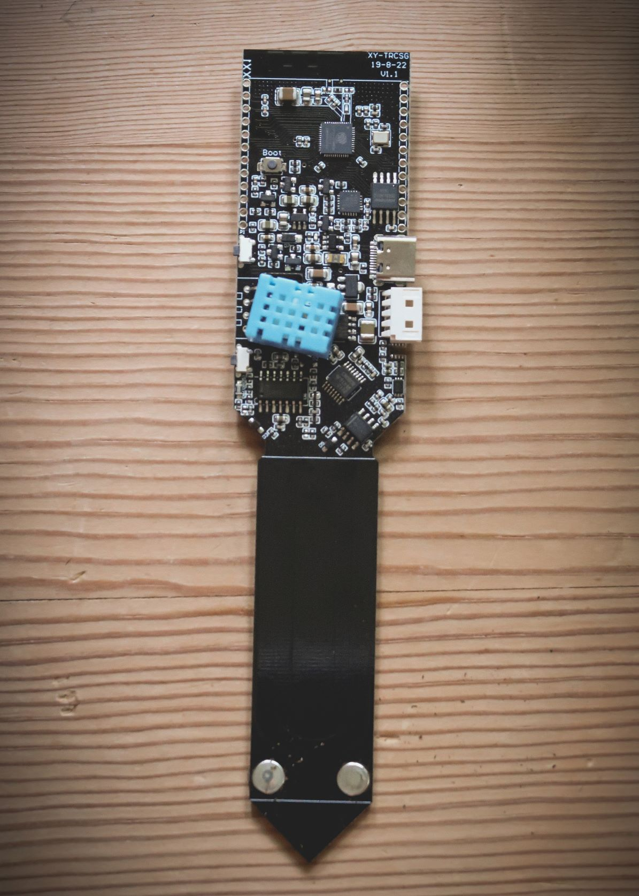
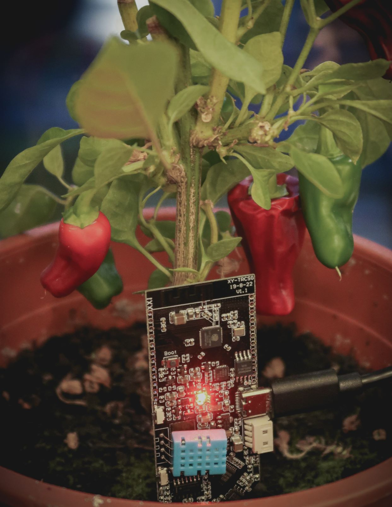
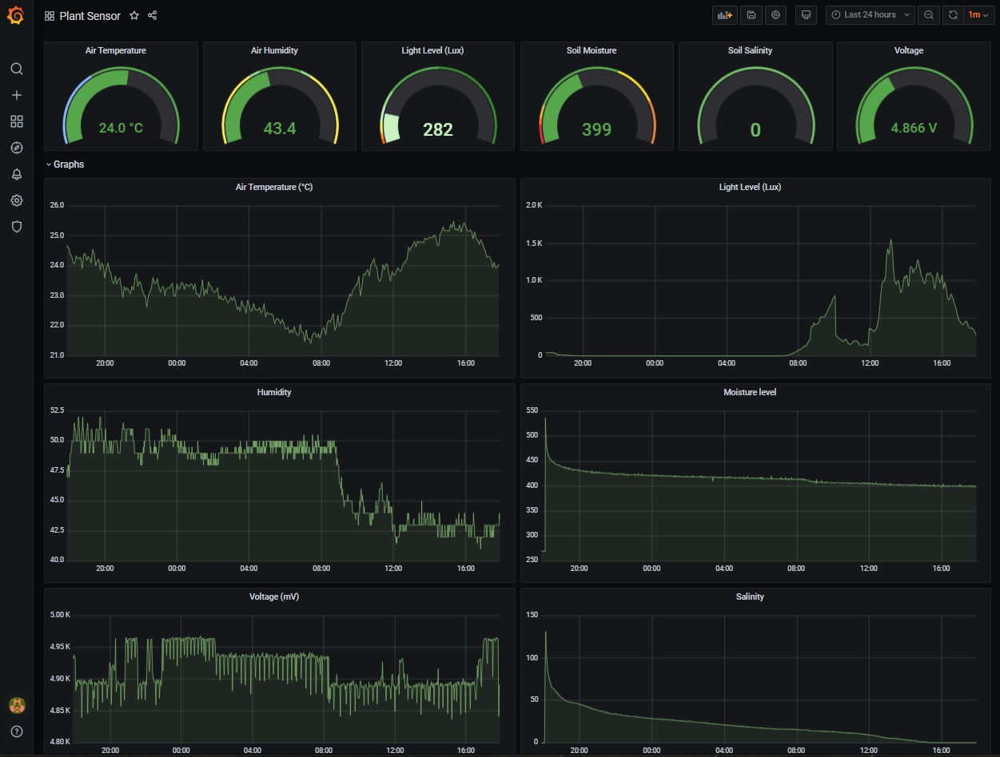

# Plant Monitor

Simple sketch for monitoring of plants with the [LILYGO® T-Higrow ESP32 board](https://www.banggood.com/LILYGO-T-Higrow-ESP32-WiFi-+-bluetooth-+-DHT11-Soil-Temperature-And-Humidity-Sensor-Module-p-1196250.html). For monitoring of my chilli plants with InfluxDB and Grafana. Project configuration and library dependencies is handled with [PlatformIO](https://platformio.org) VS Code extension.

Logs the following data:

* Air temperature and humidity
* Light amount
* Soil moisture and salinity
* Device voltage  
  
## Application Configuration

In **src/** directory, rename file **configuration_template.h** to **configuration.h**. Edit file and set configuration values as described in section below. Enable setting of configuration by uncommenting *setConfigurationPreferences()* in the *setup()* method in **main.cpp** file. Values will be persisted to Preferences nvram memory on chip.

Add the following values:

**UpdateInSeconds:** Interval in seconds for posting data to InfluxDB  
**WifiSSID:** SSID for wifi network  
**WifiPassword:** Wifi password  
**NtpServer:** Network Time Protocol server (like europe.pool.ntp.org)  
**InfluxDBHost:** Hostname or IP address of InfluxDB server  
**InfluxDBPort:** InfluxDB port (Default 8086)  
**InfluxDBDB:** Database name on InfluxDB server  
**IDBMeasure:** InfluxDB measurement name  
**PlantID:** ID for plant to identify measurement on InfluxDB  

